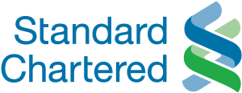

&nbsp;

#### General

The *Advanced Functional Programming* summer school has been running
for more than ten years. We aim to educate aspiring Haskell
programmers beyond the basic material covered by many textbooks.

The lectures will cover several more advanced topics regarding the
theory and practice of Haskell programming, including topics such as:

* lambda calculus;
* monads and applicative functors;
* generalized algebraic datatypes;
* datatype generic programming;
* type families and type-level programming.

The summer school consists of a mix of lectures, labs and a busy
social program. You may want to check out the preliminary
[schedule](schedule.html) to get some idea of what to expect.

The school will run from 04 July &ndash; 08 July 2022.

#### For whom

We expect students to have a basic familiarity with Haskell
already. You should be able to write recursive functions over
algebraic data types, such as lists and trees. There is a great deal
of online material freely available that covers this material. If
you've already started learning Haskell and are looking to take your
functional programming skills to the next level, this is the course
for you. Or if you're used to working in functional languages such as
Scala, PureScript, Elm, OCaml, or Racket, and looking to learn more
about foundations and Haskell -- you may want to consider joining our
summer school.

#### Venue

The lecture and lab sessions will be run online. We will have live
lectures in the (European) afternoon, but recordings will be made
available if this does not work for you. There will be supervised labs
to help you practice with the material from the lectures, also held
online.

#### Costs

We ask for a small registration fee of €50 to help cover the costs of
running the summer school. If you are keen to attend the summer
school, but unable to pay the registration fee, please contact the
organizers. We are more than happy to waive the fee, if this makes
your participation difficult.

#### Questions?

Feel free to contact Wouter Swierstra (w.s.swierstra {at} uu.nl) if
you have any questions about participating.

#### Credits

The pictures used on the landing page are by Pieter Dorp van Vliet and
Hans Splinter.

<!-- #### Sponsorship -->

<!-- We gratefully acknowledge Standard Chartered Bank and Jane Street -->
<!-- Capital for their sponsorship. -->

<!-- 
 -->

<!--  -->

<!-- &nbsp; &nbsp; &nbsp; -->

<!--  -->

<!-- &nbsp; &nbsp; &nbsp; -->

<!--  -->

<!-- 
 -->
